# **Real Estate Website - Interactive Platform**

A modern web application designed to showcase real estate listings with a sleek design, responsive layout, and interactive features. The project is built with **Next.js** and styled using Tailwind CSS.

## **Table of Contents**

1. [Project Overview](#project-overview)
2. [Features](#features)
3. [Technologies Used](#technologies-used)
4. [Deployment](#deployment)
5. [Screenshots](#screenshots)
6. [System Requirements](#system-requirements)
7. [Installation and Setup](#installation-and-setup)
8. [Contributors](#contributors)

## **Project Overview**

The Real Estate Website is a modern platform that allows users to:

- View real estate listings with an interactive map and a list view.
- Seamlessly navigate the website on both mobile and desktop devices.
- Browse an image gallery with gesture support.

### **Main Sections of the Website**

1. **Houses**: An interactive map with clickable icons leading to detailed property pages.
2. **Gallery**: A carousel of property images with swipe functionality for mobile devices.
3. **Contact**: A contact form enabling users to send inquiries directly from the website.

## **Features**

- **Real Estate Listings**:

  - Map markers link to detailed property information.
  - Scrollable property list synced with the map.

- **Image Gallery**:

  - Automatic slideshow with a 5-second interval.
  - Mobile-friendly swipe gesture support.

- **Responsive Design**:

  - Fully optimized for mobile, tablet, and desktop devices.

- **Contact Form**:
  - Allows users to submit inquiries directly from the site.

## **Technologies Used**

- **Framework**: [Next.js](https://nextjs.org/)
- **Styling**: [Tailwind CSS](https://tailwindcss.com/)
- **Icons**: [React Icons](https://react-icons.github.io/react-icons/)
- **Animations**: [AOS (Animate on Scroll)](https://michalsnik.github.io/aos/)
- **Font Handling**: [Google Fonts](https://fonts.google.com/)
- **Hosting**: [AWS Amplify](https://aws.amazon.com/amplify/)

## Deployment

The website is deployed and hosted using AWS Amplify.  
Visit the live version here: [Deployed Website Link](https://master.dtqr2u07441zd.amplifyapp.com/)

## **Screenshots**

### Home Page

<p>
    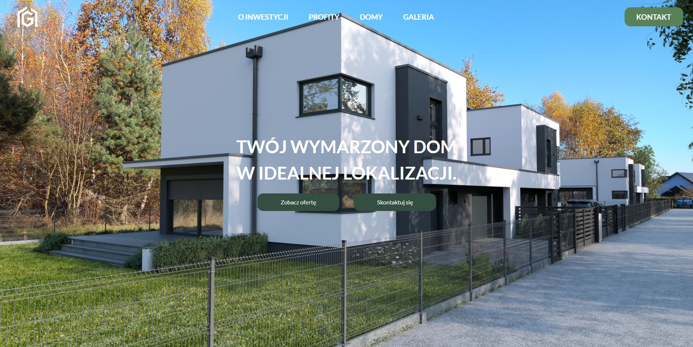
    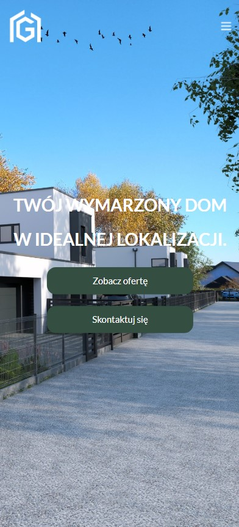
</p>

## Investment

<p>
    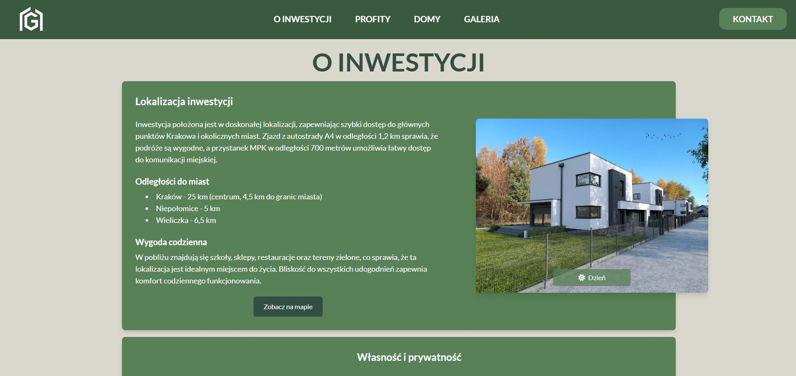
    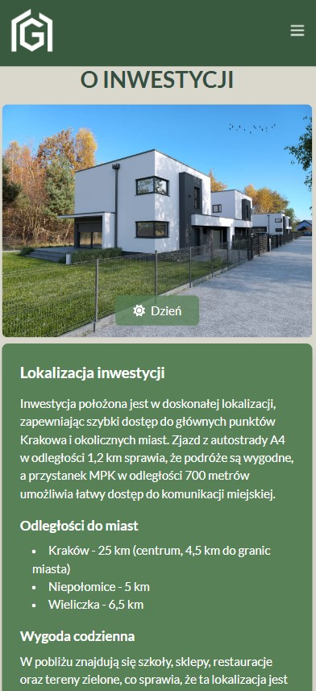
</p>

## Profit

<p>
    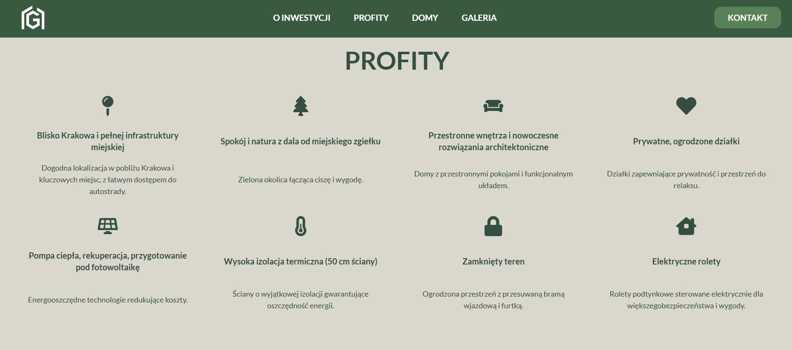
    
</p>

## Houses

<p>
    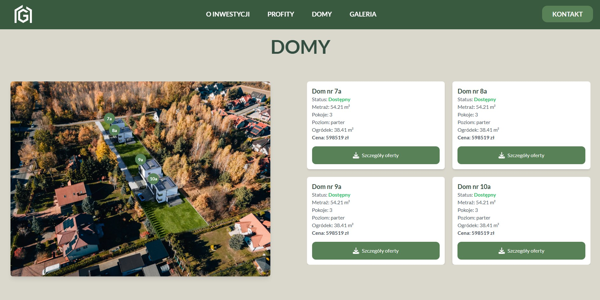
    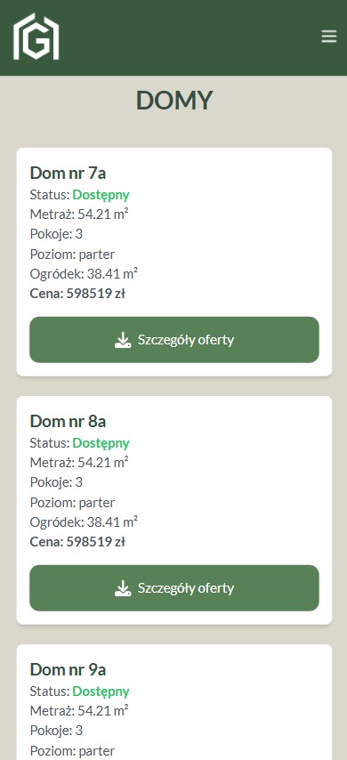
</p>

## Gallery

<p>
    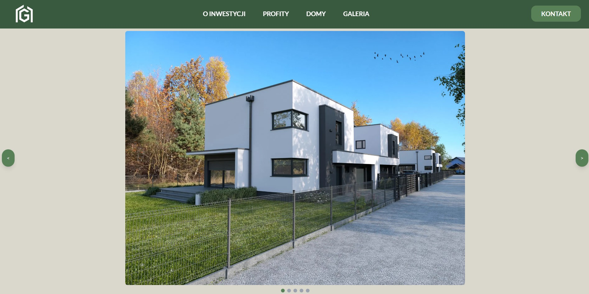
    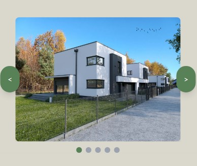
</p>

## Contact

<p>
    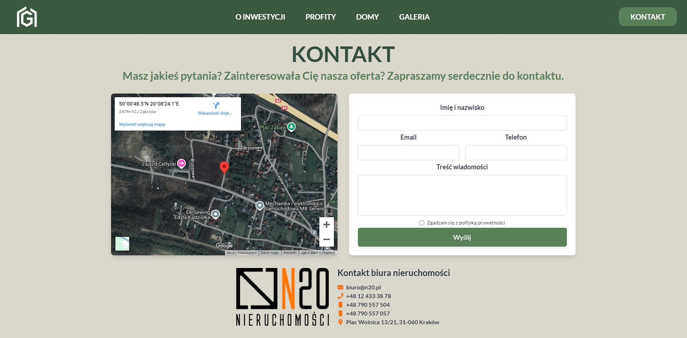
    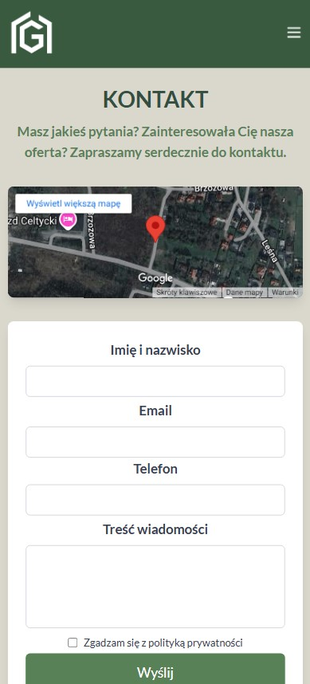
</p>

## **System Requirements**

- Node.js version 14.x or newer.
- npm or yarn package manager.

## **Installation and Setup**

1. **Clone the repository**:

   ```bash
   git clone https://github.com/ruffaaw/przebieczany-website.git
   cd your-repo-name
   ```

2. **Install dependencies**:

   ```bash
   npm install
   # or
   yarn install
   ```

3. **Run the project locally**:

   ```bash
   npm run dev
   # or
   yarn dev
   ```

4. **Open the application in your browser**:  
   The application will be available at [http://localhost:3000](http://localhost:3000).

## **Contributors**

- **Rafał Ciupek**: [GitHub](https://github.com/ruffaaw), [LinkedIn](https://www.linkedin.com/in/rafa%C5%82-ciupek-514039246/)
- **Maciej Krzyszkowski**: [LinkedIn](https://www.linkedin.com/in/maciej-krzyszkowski-1778ba259/)
